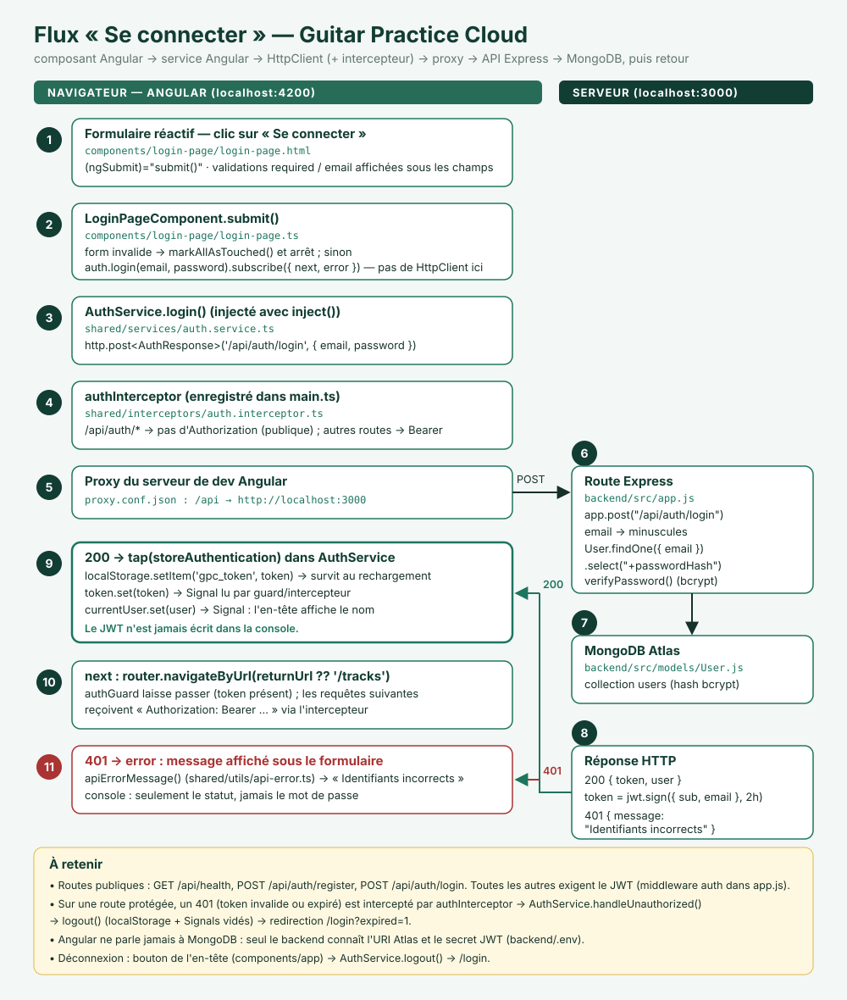

# TP1 — Livrables

Binôme : _à compléter_ · Date : 24/09/2026

Sommaire :

1. [Code frontend complété](#1-code-frontend-complété)
2. [Cartographie de l'application (mission 0)](#2-cartographie-de-lapplication-mission-0)
3. [Schéma annoté du flux de connexion](#3-schéma-annoté-du-flux-de-connexion)
4. [Preuves Network](#4-preuves-network)
5. [Signal ou localStorage ?](#5-signal-ou-localstorage-)
6. [Réponses aux questions du sujet](#6-réponses-aux-questions-du-sujet)
7. [Rapport d'usage de l'IA](#7-rapport-dusage-de-lia)

---

## 1. Code frontend complété

Toutes les fonctionnalités de la mission 1 sont en place, et `npm run build` passe.

| Fonctionnalité demandée | Où |
|---|---|
| Formulaires réactifs d'inscription et de connexion | `components/register-page/*`, `components/login-page/*` |
| Validations et messages d'erreur | Sous chaque champ (`required`, `email`, `minLength(2)` pour le nom, `minLength(8)` pour le mot de passe, comme le backend) ; les erreurs API passent par `shared/utils/api-error.ts` |
| Appels `/api/auth/register` et `/api/auth/login` | `shared/services/auth.service.ts` |
| JWT sauvegardé côté navigateur, jamais dans les logs | `AuthService.storeAuthentication()` → `localStorage['gpc_token']` ; les `console.*` n'affichent que des statuts ou des identifiants |
| Signal `currentUser` | `AuthService.currentUser`, mis à jour par `login`, `register`, `profile` et `update` |
| Redirection après succès | Connexion → `returnUrl` ou `/tracks` ; inscription → `/profile` |
| Déconnexion | Bouton dans l'en-tête (`components/app`) → `AuthService.logout()` vide `localStorage` et les Signals → `/login` |
| `GET /api/users/me` | Appelé automatiquement à l'ouverture de `/profile` (`ngOnInit`) |
| `PUT /api/users/me` | Formulaire « Nouveau nom » de la page profil |
| Gestion du `401` | `shared/interceptors/auth.interceptor.ts` → `AuthService.handleUnauthorized()` → `/login?expired=1` |
| Aucun `HttpClient` dans les composants | Les composants passent uniquement par `AuthService` (via `inject()`) |

## 2. Cartographie de l'application (mission 0)

| Élément | Fichier |
|---|---|
| Composant racine | `frontend-starter/src/app/components/app/app.ts` (+ `app.html`) |
| Démarrage de l'application | `frontend-starter/src/main.ts` (`bootstrapApplication(AppComponent, …)`) |
| Configuration des routes | `frontend-starter/src/app/routes.ts` |
| Enregistrement de `HttpClient` | `frontend-starter/src/main.ts` : `provideHttpClient(withInterceptors([authInterceptor]))` |
| Modèles | `src/app/shared/models/` (`user`, `auth-response`, `track`, `page`) |
| Services | `src/app/shared/services/` (`auth.service.ts`, `track.service.ts`) |
| Pages | `src/app/components/` (`login-page`, `register-page`, `profile-page`, `tracks-page`) |
| Ajout du JWT aux requêtes protégées | `src/app/shared/interceptors/auth.interceptor.ts` |
| Protection des routes Angular | `src/app/shared/guards/auth.guard.ts` : sans token, redirection vers `/login` (le guard n'ajoute pas le JWT) |
| Redirection `/api` vers le backend | `frontend-starter/proxy.conf.json` → `http://localhost:3000` |

**Routes publiques et protégées** (`API_CONTRACT.md`) :

- publiques : `GET /api/health`, `POST /api/auth/register`, `POST /api/auth/login` ;
- protégées par JWT : `GET` et `PUT /api/users/me`, `GET` et `POST /api/tracks`, `GET /api/tracks/:id/audio`, `DELETE /api/tracks/:id`.

## 3. Schéma annoté du flux de connexion



En résumé :

1. Le formulaire déclenche `submit()`.
2. Le composant appelle `AuthService.login()`.
3. Le service envoie la requête avec `HttpClient`, et l'intercepteur la laisse passer sans `Authorization` (route publique).
4. Le proxy transmet la requête à Express.
5. Express appelle `User.findOne` dans MongoDB, puis vérifie le mot de passe avec bcrypt.
6. En cas de réponse `200 {token, user}`, le service exécute `tap`, qui enregistre le token dans `localStorage`, met à jour les Signals `token` et `currentUser`, puis déclenche la redirection. En cas de `401`, le message d'erreur s'affiche.

## 4. Preuves Network

Requêtes réellement observées le 24/09/2026 (navigateur et logs du backend) :

| # | Scénario | Méthode et URL | Corps envoyé | Statut | Réponse | `Authorization` |
|---|---|---|---|---|---|---|
| 1 | Connexion refusée (email inconnu) | `POST /api/auth/login` | `{ email, password }` | **401** | `{ "message": "Identifiants incorrects" }` | Absent (route publique) |
| 2 | Connexion réussie (compte de démo) | `POST /api/auth/login` | `{ email, password }` | **200** | `{ token: "<masqué>", user: { id, name, email, createdAt } }` | Absent (route publique) |
| 3 | Liste des pistes après redirection | `GET /api/tracks?page=1&limit=5` | — | **200** | `Page<Track>` | `Bearer <masqué>` |
| 4 | Lecture du profil | `GET /api/users/me` | — | **200** | `User` | `Bearer <masqué>` |
| 5 | Modification du nom | `PUT /api/users/me` | `{ "name": "…" }` | **200** | `User` avec le nouveau nom | `Bearer <masqué>` |
| 6 | Token invalide (faux token dans `localStorage`) | `GET /api/users/me` | — | **401** | `{ "message": "Jeton invalide ou expiré" }` → redirection vers `/login?expired=1` | `Bearer <faux>` |

Traces correspondantes dans le terminal du backend (`npm start`) :

```text
[auth] Identifiants incorrects pour inconnu@example.com
[http] POST /api/auth/login -> 401 (25 ms)
[auth] Connexion réussie : 6aac022f01a0ef81ffde61b2
[http] POST /api/auth/login -> 200 (94 ms)
[http] GET /api/tracks?page=1&limit=5 -> 200 (18 ms)
[user] Profil envoyé : 6aac022f01a0ef81ffde61b2
[http] GET /api/users/me -> 200 (19 ms)
[user] Nom mis à jour : 6aac022f01a0ef81ffde61b2
[http] PUT /api/users/me -> 200 (27 ms)
```

> Les traces du backend s'affichent dans le terminal où tourne `npm start` (dossier `backend/`), et non dans le navigateur.

**Captures d'écran** (DevTools → Network → filtre Fetch/XHR). Avant de faire la capture, masquez le mot de passe (onglet Payload) et le token (onglet Response).

| Capture | Fichier |
|---|---|
| Connexion réussie (200) | [captures/network-login-200.png](captures/network-login-200.png) |
| Connexion refusée (401) | [captures/network-login-401.png](captures/network-login-401.png) |
| `GET` ou `PUT /api/users/me` avec `Authorization` | [captures/network-users-me.png](captures/network-users-me.png) |

## 5. Signal ou localStorage ?

| | Signal (`signal()`) | `localStorage` |
|---|---|---|
| Nature | Valeur réactive **en mémoire**, gérée par Angular | Stockage **persistant** du navigateur (clé → chaîne), propre à chaque origine |
| Durée de vie | Disparaît au rechargement de la page ou à la fermeture de l'onglet | Survit au rechargement et au redémarrage du navigateur, jusqu'à suppression |
| Réactivité | Tout template, `computed()` ou `effect()` qui lit le Signal se met à jour automatiquement | Aucune : Angular n'est pas prévenu quand la valeur change |
| Type | N'importe quelle valeur typée (`User \| null`) | Chaînes uniquement (sinon `JSON.stringify`) |
| Usage dans le TP | `currentUser` et `token` : l'état d'authentification affiché par l'interface | `gpc_token` : garder le JWT d'une visite à l'autre |

**Comment ils fonctionnent ensemble** : au démarrage, le Signal `token` est initialisé depuis `localStorage`. À la connexion, on écrit dans les deux. À la déconnexion ou sur un `401`, on vide les deux. `localStorage` sert donc à **conserver** le token, et le Signal sert à **réagir** à ses changements. Point de sécurité : `localStorage` est lisible par tout script de la page, donc sensible aux failles XSS. Il ne faut donc jamais y mettre de mot de passe, ni afficher le token dans la console.

## 6. Réponses aux questions du sujet

**Quelles routes du backend sont utilisées ?**

| Route | Utilisée par | Accès |
|---|---|---|
| `POST /api/auth/register` | Page d'inscription | Publique |
| `POST /api/auth/login` | Page de connexion | Publique |
| `GET /api/users/me` | Page profil | JWT |
| `PUT /api/users/me` | Page profil | JWT |
| `GET /api/tracks` | Page des pistes | JWT |
| `POST /api/tracks` | Upload d'une piste | JWT |
| `GET /api/tracks/:id/audio` | Écoute d'une piste | JWT |
| `GET /api/health` | Vérification manuelle que l'API répond | Publique |

**Où s'effectue la tâche « mise à jour du profil utilisateur » ?**

- Côté front :
  1. `components/profile-page/profile-page.html` : formulaire « Nouveau nom » ;
  2. `components/profile-page/profile-page.ts` : `save()` ;
  3. `shared/services/auth.service.ts` : `update(name)` envoie `PUT /api/users/me` et met à jour `currentUser` ;
  4. `shared/interceptors/auth.interceptor.ts` : ajoute `Authorization: Bearer`.
- Côté back :
  1. `backend/src/app.js` : `app.put("/api/users/me", auth, …)` ;
  2. le middleware `auth` vérifie le JWT ;
  3. `User.findByIdAndUpdate(req.auth.sub, { $set: { name } }, { runValidators: true })` enregistre le nouveau nom ;
  4. `backend/src/models/User.js` : `name` est obligatoire et fait au moins 2 caractères.

**Quel modèle d'IA ? Comment connaître les tokens consommés ? Qui conseille le bon modèle ?**

- Modèle : Claude Opus 5.5, utilisé dans Claude Code (application desktop).
- Tokens consommés :
  - dans un terminal `claude` : `/usage` (ou `/cost`) ;
  - sur claude.ai : Settings → Usage ;
  - avec une clé API : le tableau de bord de la console Anthropic.
  - Une estimation donnée par le modèle n'est pas une mesure officielle.
- Choix du modèle :
  - où se renseigner : la documentation du fournisseur (page « choosing a model »), l'enseignant, ou l'assistant lui-même (prompt proposé dans `CONSEILS_POUR_UTIISER_ASSISTANT_AI.md`, section 10) ;
  - pour ce TP, **Sonnet 5** offre le meilleur rapport qualité/tokens ;
  - Haiku 4.5 suffit pour une explication rapide ;
  - Opus est réservé aux bugs difficiles et à l'architecture.

## 7. Rapport d'usage de l'IA

Voir [`RAPPORT_IA_MODELE.md`](../../RAPPORT_IA_MODELE.md).
