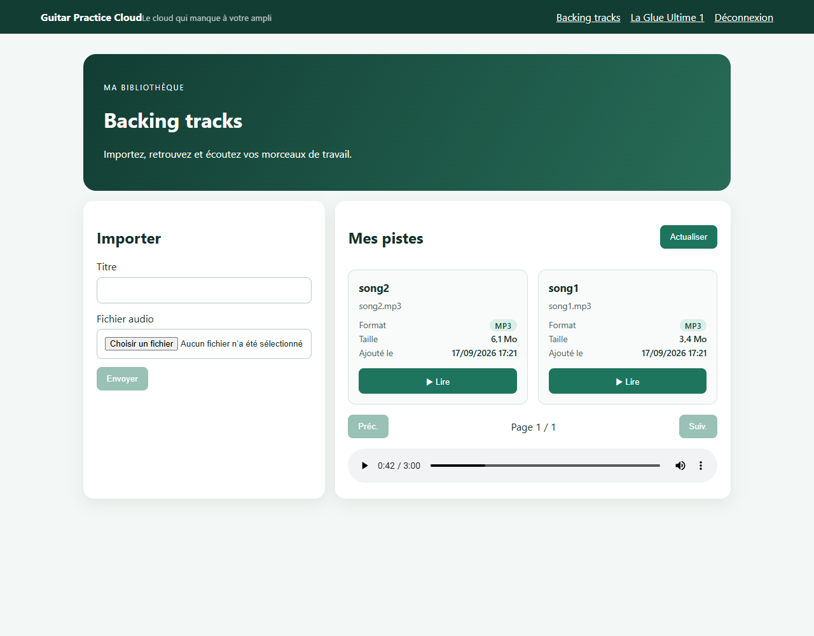
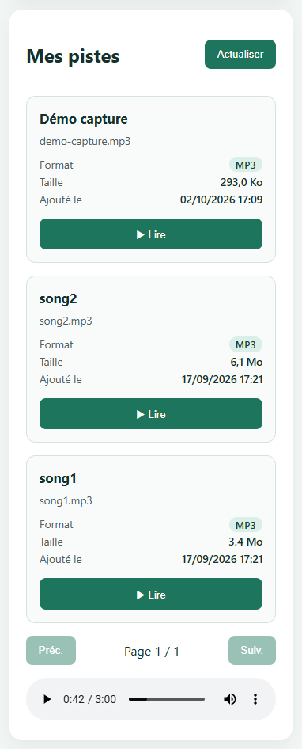
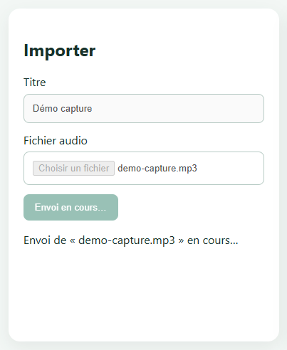
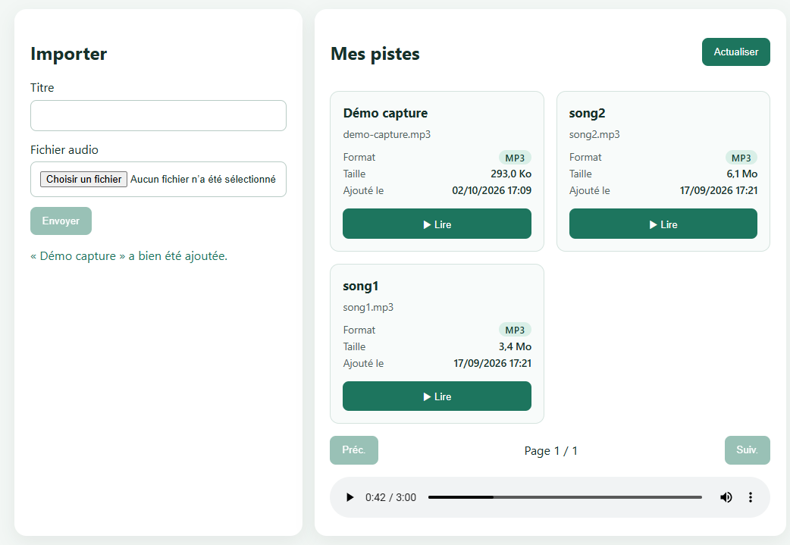
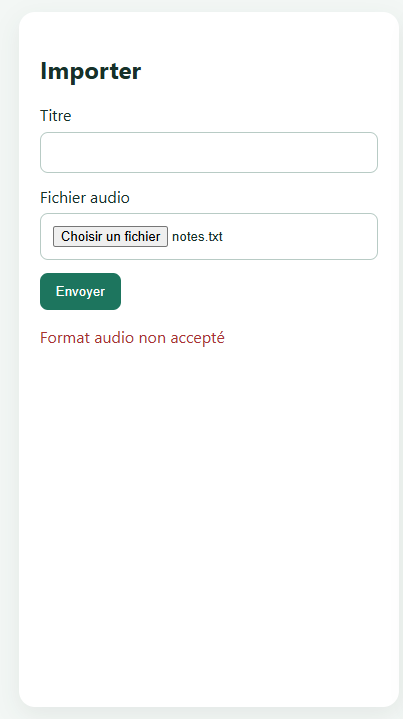

# TP2 — Compte rendu

Binôme : _à compléter_

Sommaire :

0. [Livrables TP2 — état](#livrables-tp2--état)
1. [Mission 2 — Bibliothèque paginée](#mission-2--bibliothèque-paginée)
2. [Mission 3 — Analyse de l'upload et de la lecture audio](#mission-3--analyse-de-lupload-et-de-la-lecture-audio)
   - [A.1 Cartographie de l'upload](#a1-cartographie-de-lupload)
   - [A.2 Cartographie de la lecture](#a2-cartographie-de-la-lecture)
   - [A.3 Intercepteur et JWT](#a3-intercepteur-et-jwt)
   - [A.4 Contrôles du backend et cohérence du `FormData`](#a4-contrôles-du-backend-et-cohérence-du-formdata)
   - [A.5 Constats pour la suite de la mission](#a5-constats-pour-la-suite-de-la-mission)
   - [B. Interface pendant l'envoi](#b-interface-pendant-lenvoi)
   - [C. Cards de bibliothèque](#c-cards-de-bibliothèque)
   - [D. Démonstration de la lecture audio authentifiée](#d-démonstration-de-la-lecture-audio-authentifiée)
   - [E. Pourquoi `Blob` et `ObjectURL`](#e-pourquoi-blob-et-objecturl)
   - [F. Questions sur la mémoire, le buffering et le streaming](#f-questions-sur-la-mémoire-le-buffering-et-le-streaming)
3. [Captures](#captures)

---

## Livrables TP2 — état

| Livrable | Où | État |
|---|---|---|
| Code frontend complété | `frontend-starter/src/app/` | **Partiel** — voir le tableau ci-dessous |
| Cards de bibliothèque lisibles | [Section C](#c-cards-de-bibliothèque) | ✅ Fait |
| Capture Network de la pagination ou de l'upload | [Captures](#captures) : captures de l'upload + trace réseau réelle | ✅ Trace réseau et captures de l'interface ; captures DevTools à ajouter par le binôme |
| Capture ou démonstration de la lecture audio authentifiée | [Section D](#d-démonstration-de-la-lecture-audio-authentifiée) + [capture](#bibliothèque-en-cards-avec-un-morceau-en-lecture) | ✅ Fait |
| Explication écrite du choix `Blob` et `ObjectURL` | [Section E](#e-pourquoi-blob-et-objecturl) | ✅ Fait |
| Réponses aux questions sur la mémoire, le buffering et le streaming | [Section F](#f-questions-sur-la-mémoire-le-buffering-et-le-streaming) | ✅ Fait |

**État du code** :

| Mission | Exigence | État |
|---|---|---|
| 2 | `TrackService.list(page, limit)` transmet `page` et `limit` | ✅ Déjà présent, vérifié |
| 2 | Signals `tracks`, `page`, `pages`, `loading` ; `@for` / `@empty` / `@if` ; boutons désactivés aux bornes | ✅ Déjà présents |
| 2 | Signal `error` et son affichage ; boutons désactivés pendant le chargement ; garde de bornes dans `go()` | ❌ **À faire** (étapes 3-4 de la mission 2) |
| 3 | Interface pendant l'envoi (chargement, anti double envoi, erreurs, succès, réinitialisation) | ✅ Fait (section B) |
| 3 | Cards responsives et accessibles | ✅ Fait (section C) |
| 3 | Validation du format et de la taille avant l'envoi | ❌ **À faire** |
| 3 | Affichage du morceau en cours, erreur audio compréhensible | ❌ **À faire** |
| 3 | Révocation de la dernière `ObjectURL` à la destruction du composant | ❌ **À faire** |

---

## Mission 2 — Bibliothèque paginée

**Flux** : composant `TracksPageComponent.load()` → `TrackService.list(page, limit)` → `HttpClient` → `GET /api/tracks?page=…&limit=…`. Chaque clic sur « Précédent » / « Suivant » appelle `go(page)`, qui met à jour le Signal `page` puis relance `load()` : **une nouvelle requête HTTP par page**, sans découpage local.

**Preuve de la pagination côté serveur** (02/10/2026, compte démo, 2 pistes). La bibliothèque ne tient que sur une page avec `limit=5` ; la pagination a donc été démontrée avec `limit=1` :

| Requête | Réponse |
|---|---|
| `GET /api/tracks?page=1&limit=1` | `page: 1`, `pages: 2`, `total: 2`, `items: [song2]` |
| `GET /api/tracks?page=2&limit=1` | `page: 2`, `items: [song1]` |

Chaque page correspond à une requête distincte, et le serveur ne renvoie que les éléments de cette page.

_Étapes 3 à 6 (Signal d'erreur, template, tests, explication) : à faire. Voir le suivi dans `RAPPORT_IA_MODELE.md`._

---

## Mission 3 — Analyse de l'upload et de la lecture audio

> Partie A : analyse uniquement. Aucun fichier de code n'a été modifié pour cette partie.
> Tous les chemins frontend sont relatifs à `frontend-starter/src/app/`.

### A.1 Cartographie de l'upload

Flux : **composant → service → `HttpClient` (+ intercepteur) → API Express → Multer (disque) → MongoDB**

| # | Étape | Fichier | Méthode / ligne | Détail |
|---|---|---|---|---|
| 1 | Saisie du titre | `components/tracks-page/tracks-page.html` | l. 11 : `<input [formControl]="title">` | `FormControl` non nullable déclaré dans `tracks-page.ts` l. 19 |
| 2 | Choix du fichier | `components/tracks-page/tracks-page.html` | l. 12 : `<input type="file" accept="audio/*" (change)="choose($event)">` | Le sélecteur propose tous les types `audio/*` |
| 3 | Mémorisation du fichier | `components/tracks-page/tracks-page.ts` | `choose(event)` l. 26-29 | `this.file = input.files?.[0]` (simple propriété, pas un Signal) |
| 4 | Clic sur « Envoyer » | `components/tracks-page/tracks-page.html` | l. 13 : `(click)="upload()"`, `[disabled]="!file"` | Bouton actif dès qu'un fichier est choisi |
| 5 | Lancement de l'envoi | `components/tracks-page/tracks-page.ts` | `upload()` l. 52-65 | Titre = `title.value` ou, à défaut, `file.name` ; appelle `service.upload(...)` |
| 6 | Construction du `FormData` | `shared/services/track.service.ts` | `upload(file, title)` l. 17-22 | `body.append('audio', file)` puis `body.append('title', title)` |
| 7 | Appel HTTP | `shared/services/track.service.ts` | l. 21 : `http.post<Track>('/api/tracks', body)` | Pas de `Content-Type` manuel : le navigateur génère `multipart/form-data; boundary=…` |
| 8 | Ajout du JWT | `shared/interceptors/auth.interceptor.ts` | l. 16-18 | `Authorization: Bearer <token>` (route non `/api/auth/*`) |
| 9 | Proxy | `proxy.conf.json` | — | `/api` → `http://localhost:3000` |
| 10 | Vérification du JWT | `backend/src/app.js` | middleware `auth`, l. 56 | Exécuté **avant** Multer : sans token valide, rien n'est écrit sur le disque |
| 11 | Réception du multipart | `backend/src/app.js` | `upload.single("audio")`, l. 337 | Filtre MIME + limite de taille (voir A.4) ; fichier écrit dans `data/uploads/` sous un nom `UUID + extension` |
| 12 | Enregistrement des métadonnées | `backend/src/app.js` | `Track.create(...)`, l. 345-352 | `ownerId`, `title`, `originalName`, `storedName`, `mimeType`, `size` |
| 13 | Réponse | `backend/src/app.js` | `201` + `track.toPublic()` | En cas d'échec MongoDB, le fichier orphelin est supprimé (l. 361-362) |
| 14 | Retour dans le composant | `components/tracks-page/tracks-page.ts` | `next` de `upload()` l. 56-62 | Vide le titre et `this.file`, repasse en page 1, appelle `load()` |

### A.2 Cartographie de la lecture

Flux : **clic « ▶ » → service → `HttpClient` (+ JWT) → API → flux disque → `Blob` → `ObjectURL` → `<audio>`**

| # | Étape | Fichier | Méthode / ligne | Détail |
|---|---|---|---|---|
| 1 | Clic sur « ▶ » | `components/tracks-page/tracks-page.html` | l. 30 : `(click)="play(track)"` | Bouton avec `aria-label="Lire <titre>"` |
| 2 | Demande du fichier | `components/tracks-page/tracks-page.ts` | `play(track)` l. 67-77 | Appelle `service.audio(track.id)` |
| 3 | Requête HTTP | `shared/services/track.service.ts` | `audio(id)` l. 24-28 | `GET /api/tracks/:id/audio` avec `responseType: 'blob'` |
| 4 | Ajout du JWT | `shared/interceptors/auth.interceptor.ts` | l. 16-18 | Voir A.3 |
| 5 | Contrôle d'accès | `backend/src/app.js` | `app.get("/api/tracks/:id/audio", auth, …)`, l. 379-383 | `Track.findOne({ _id, ownerId: req.auth.sub })` : une piste d'un autre utilisateur donne **404** |
| 6 | Envoi du fichier | `backend/src/app.js` | l. 392-394 : `res.type(track.mimeType)` puis `res.sendFile(audioPath)` | `sendFile` **lit le fichier en flux depuis le disque**, sans le charger entièrement en mémoire |
| 7 | Réception du `Blob` | `components/tracks-page/tracks-page.ts` | `next: (blob) => …` l. 69 | `HttpClient` ne déclenche `next` qu'**une fois le fichier entièrement téléchargé** |
| 8 | Révocation de l'ancienne URL | `components/tracks-page/tracks-page.ts` | l. 71-72 : `URL.revokeObjectURL(previousUrl)` | Libère le `Blob` du morceau précédent |
| 9 | Création de l'`ObjectURL` | `components/tracks-page/tracks-page.ts` | l. 73 : `audioUrl.set(URL.createObjectURL(blob))` | URL locale de la forme `blob:http://localhost:4200/…` |
| 10 | Affectation au lecteur | `components/tracks-page/tracks-page.html` | l. 40-42 : `<audio [src]="audioUrl()" controls autoplay>` | Le lecteur lit le `Blob` en mémoire : aucune nouvelle requête réseau |

**Pourquoi `Blob` + `ObjectURL` ?** C'est la seule façon, avec `HttpClient`, de récupérer un fichier protégé par un en-tête `Authorization`, puis de le donner à `<audio>`. L'élément `<audio>` ne sait lire qu'une URL, d'où la conversion en URL locale.

### A.3 Intercepteur et JWT

**Où le JWT est-il ajouté ?** Dans `shared/interceptors/auth.interceptor.ts`, l. 16-18 :

```ts
const authorized = token && !isAuthRoute
  ? request.clone({ setHeaders: { Authorization: `Bearer ${token}` } })
  : request;
```

- L'intercepteur est enregistré dans `main.ts` : `provideHttpClient(withInterceptors([authInterceptor]))`.
- Il s'applique à **toutes les requêtes faites via `HttpClient`**, donc à `GET /api/tracks/:id/audio` (`TrackService.audio()`) et à `POST /api/tracks` (`TrackService.upload()`).
- Seules les routes `/api/auth/*` (login et register) ne reçoivent pas le token.
- Le token vient du Signal `AuthService.token()`, initialisé depuis `localStorage['gpc_token']`.
- Vérification dans Network : sélectionner la requête `audio`, onglet *Headers* → *Request Headers* → `Authorization: Bearer …`. La réponse a un `Content-Type: audio/mpeg` (ou autre format audio).

**Pourquoi une URL placée directement dans `src` n'envoie pas le JWT ?**

```html
<audio src="/api/tracks/123/audio"></audio>   <!-- → 401 « Authentification requise » -->
```

- **Ce n'est pas Angular qui fait la requête.** Avec `src`, c'est le lecteur multimédia du navigateur qui télécharge le fichier, directement. La requête ne passe pas par `HttpClient`, donc les intercepteurs ne sont jamais exécutés.
- **Le HTML ne permet pas d'ajouter un en-tête.** Les balises `<audio>`, `<video>` et `` n'ont aucun attribut pour fixer un en-tête comme `Authorization`. Le navigateur n'envoie automatiquement que ses en-têtes standards et les **cookies**.
- **Le JWT n'est pas dans un cookie.** Il est stocké dans `localStorage`, que le navigateur n'envoie jamais tout seul.
- **Résultat :** le middleware `auth` du backend ne trouve pas `Bearer ` (`app.js` l. 62) et répond `401`.
- **Solutions possibles :**
  - celle du projet : télécharger le fichier en `Blob` via `HttpClient`, puis créer une `ObjectURL` ;
  - utiliser un cookie `HttpOnly` ;
  - utiliser une URL signée à courte durée de vie.
- **À éviter :** mettre le token dans l'URL (`?token=…`). Il apparaîtrait dans l'historique et dans les logs du serveur et du proxy.

### A.4 Contrôles du backend et cohérence du `FormData`

| Contrôle | Où dans `backend/src/app.js` | Comportement |
|---|---|---|
| **Authentification avant l'upload** | l. 336-337 : `auth` placé avant `upload.single("audio")` | `401` sans token valide, avant toute écriture sur le disque |
| **Fichier `audio` obligatoire** | `upload.single("audio")` l. 337 ; `if (!req.file)` l. 340 | Seul le champ multipart **nommé `audio`** est lu. S'il manque : `400 { message: "Fichier audio requis" }`. Un fichier envoyé sous un autre nom est rejeté par Multer (`MulterError` « Unexpected field », donc `400`) |
| **Champ `title`** | l. 347 : `title: req.body.title \|\| req.file.originalname` | Champ texte facultatif ; à défaut, on prend le nom d'origine du fichier |
| **Types MIME autorisés** | `allowed` l. 34-40 ; `fileFilter` l. 109-116 | `audio/mpeg`, `audio/wav`, `audio/x-wav`, `audio/ogg`, `audio/mp4`, `audio/x-m4a` (MP3, WAV, OGG, M4A). Sinon : `Error("Format audio non accepté")`, transformée en `400` par le gestionnaire central (l. 446-447) |
| **Taille maximale de 25 Mo** | `MAX_FILE_SIZE = 25 * 1024 * 1024` l. 31 ; `limits: { fileSize }` l. 108 | 26 214 400 octets. Au-delà : `MulterError LIMIT_FILE_SIZE`, donc `400` (l. 446) |
| **Nom de stockage** | `diskStorage.filename` | `crypto.randomUUID()` + extension : évite les collisions et l'usage du nom fourni par le client comme chemin |

**Le `FormData` du frontend correspond-il exactement ?** Oui.

| Attendu par le backend | Envoyé par `TrackService.upload()` | Conforme |
|---|---|---|
| Fichier dans le champ `audio` (`upload.single("audio")`) | `body.append('audio', file)` | ✅ |
| Texte dans le champ `title` (`req.body.title`) | `body.append('title', title)` | ✅ |
| `multipart/form-data` | `FormData` passé tel quel à `http.post` : le navigateur fixe le `Content-Type` et la *boundary* | ✅ |
| JWT | Ajouté par l'intercepteur | ✅ |

**Vérification en conditions réelles** (02/10/2026, `fetch` avec le JWT du compte démo ; pistes de test supprimées ensuite) :

| # | Requête envoyée à `POST /api/tracks` | Statut | Réponse |
|---|---|---|---|
| 1 | Sans en-tête `Authorization` | **401** | `Authentification requise` |
| 2 | Champ `title` seul, sans fichier | **400** | `Fichier audio requis` |
| 3 | Fichier envoyé dans un champ nommé `file` | **400** | `Unexpected field` (Multer) |
| 4 | Fichier `text/plain` | **400** | `Format audio non accepté` |
| 5 | Fichier `audio/flac` (audio, mais hors liste) | **400** | `Format audio non accepté` |
| 6 | `audio/mpeg` de 25 Mo + 1 octet | **400** | `File too large` (Multer) |
| 7 | `audio/mpeg` valide + `title = "verif-titre"` | **201** | `title: "verif-titre"`, `mimeType: "audio/mpeg"` |
| 8 | `audio/mpeg` valide sans `title` | **201** | `title: "test.mp3"` (repli sur `originalname`) |

Les messages des cas 3 et 6 viennent de Multer et sont en anglais.

Remarques :

- Le frontend envoie toujours un `title` non vide, car `upload()` remplace un titre vide par `file.name`. Le repli du backend sur `originalname` ne sert donc qu'aux clients qui n'envoient pas de titre.
- Le type vérifié par le backend (`file.mimetype`) est **celui déclaré par le navigateur** dans la partie multipart, déduit de l'extension. Le contenu réel du fichier n'est pas analysé.

### A.5 Constats pour la suite de la mission

Points relevés pendant l'analyse, à traiter dans les étapes 5 à 10 :

| Constat | Fichier | Étape concernée |
|---|---|---|
| `accept="audio/*"` est plus large que les formats acceptés par le backend (par exemple FLAC : accepté dans le sélecteur, refusé avec un `400`) | `tracks-page.html` l. 12 | 5 — validation avant l'envoi |
| Aucune vérification de la taille ni du type avant l'envoi | `tracks-page.ts` `upload()` | 5 |
| Pas d'état d'envoi : un double clic envoie le fichier deux fois | `tracks-page.ts`, `.html` l. 13 | 6 — **corrigé** |
| Les erreurs du serveur ne vont que dans la console, et il n'y a pas de message de succès | `tracks-page.ts` l. 63 | 6 — **corrigé** |
| Le `<input type="file">` garde le nom du fichier après un envoi réussi (seul `this.file` est vidé) | `tracks-page.ts` l. 59 | 6 — **corrigé** |
| La taille est affichée en « Ko » alors que `track.size` est en **octets** | `tracks-page.html` l. 28 | 7 — **corrigé** |
| Le format et la date d'ajout ne sont pas affichés | `tracks-page.html` | 7 — **corrigé** |
| Le morceau en cours n'est pas affiché | `tracks-page.ts` `play()` | 8 |
| Une erreur de lecture ne va que dans la console | `tracks-page.ts` l. 75 | 9 |
| Pas de `ngOnDestroy` : la dernière `ObjectURL` n'est jamais révoquée | `tracks-page.ts` | 10 |

### B. Interface pendant l'envoi

Fichiers : `components/tracks-page/tracks-page.ts` (`upload()`, `resetUploadForm()`) et `tracks-page.html` (carte « Importer »).

| Exigence | Implémentation | Testé |
|---|---|---|
| État de chargement | Signal `uploading` ; le bouton affiche « Envoi en cours… » ; message « Envoi de « fichier » en cours… » (`role="status"`) | ✅ |
| Bouton désactivé, pas de double envoi | Bouton, champ fichier et titre désactivés ; `upload()` ne fait rien si `uploading()` est vrai | ✅ Un double clic ne produit **qu'une seule** requête `POST` |
| Erreurs du serveur | Signal `uploadError`, message de l'API via `apiErrorMessage()` (`role="alert"`) | ✅ « Format audio non accepté » s'affiche |
| Message de succès | Signal `uploadSuccess` : « « titre » a bien été ajoutée. » | ✅ |
| Formulaire vidé et page 1 rechargée | Titre vidé, champ fichier vidé (`viewChild`), `page.set(1)` puis `load()` | ✅ La piste apparaît en tête de la page 1 |

### C. Cards de bibliothèque

Fichiers : `tracks-page.html`, `tracks-page.css`, `shared/utils/track-format.ts` (nouveau).

Chaque card affiche :
- le **titre** ;
- le **nom original** ;
- le **format** (badge « MP3 », à partir du type MIME) ;
- la **taille** lisible (« 3,4 Mo » ; l'ancienne version affichait des octets suffixés « Ko ») ;
- la **date d'ajout** (« 17/09/2026 17:21 ») ;
- un bouton **« ▶ Lire »**.

- **Responsive** : `grid-template-columns: repeat(auto-fill, minmax(210px, 1fr))` donne une colonne sur mobile et plusieurs sur ordinateur. Le bouton reste aligné en bas de chaque card.
- **Accessible** :
  - liste `<ul>` nommée « Mes pistes audio », avec une card `<article>` par piste, reliée à son titre `<h3>` ;
  - métadonnées dans une liste de définitions `<dl>` ;
  - date dans `<time datetime>` ;
  - bouton annoncé « Lire song1 », avec le symbole ▶ masqué aux lecteurs d'écran ;
  - focus clavier visible ;
  - mise en évidence de la card avec `:focus-within`.

### D. Démonstration de la lecture audio authentifiée

Tests réalisés le 02/10/2026 depuis l'application connectée (compte démo), sur la piste `song1` (`audio/mpeg`, 3 605 337 octets) :

| # | Requête | Statut | Résultat |
|---|---|---|---|
| 1 | `GET /api/tracks/:id/audio` **avec** `Authorization: Bearer …` (comme `TrackService.audio()`) | **200** | `Content-Type: audio/mpeg`, `Content-Length: 3605337`, `Accept-Ranges: bytes` ; `Blob` de 3 605 337 octets reçu |
| 2 | Même URL **sans** en-tête `Authorization` | **401** | `Authentification requise` |
| 3 | `<audio src="/api/tracks/:id/audio">` (URL directe) | **401** côté backend (`[auth] Authorization absente`) | Le lecteur échoue : `MEDIA_ELEMENT_ERROR: Format error`, car il a reçu du JSON au lieu de l'audio |
| 4 | Même URL avec `Range: bytes=0-1023` | **206** | `Content-Range: bytes 0-1023/3605337` : seulement 1 024 octets envoyés |
| 5 | Identifiant de piste inexistant | **404** | `Piste inconnue` |
| 6 | Clic sur « ▶ Lire » dans l'interface | **200** | Le lecteur reçoit une URL `blob:http://localhost:4200/…` ; durée lue : 180 s |

Logs du backend correspondants :

```text
[http] GET /api/tracks/6aac058001a0ef81ffde61b3/audio -> 200 (98 ms)
[auth] Authorization absente pour GET /api/tracks/6aac058001a0ef81ffde61b3/audio
[http] GET /api/tracks/6aac058001a0ef81ffde61b3/audio -> 401 (1 ms)
[http] GET /api/tracks/000000000000000000000000/audio -> 404 (23 ms)
```

Le test 3 confirme la section A.3 : sans `HttpClient`, l'intercepteur ne s'exécute pas, donc le JWT n'est pas envoyé.

**Contrôle de propriété** : le backend cherche la piste avec `{ _id, ownerId: req.auth.sub }` (`app.js` l. 381-384). La piste d'un autre utilisateur est traitée comme inexistante, donc **404** (même réponse qu'au test 5). Pour le prouver avec un second compte, il faut créer un autre utilisateur, se connecter avec et demander l'audio d'une piste du compte démo : _test à faire par le binôme_.

### E. Pourquoi `Blob` et `ObjectURL`

1. **La route audio est protégée par un JWT** envoyé dans l'en-tête `Authorization`. Or un `<audio src="…">` est chargé directement par le navigateur, qui n'ajoute pas cet en-tête : la démonstration D.3 donne 401.
2. **On passe donc par `HttpClient`**, pour que l'intercepteur ajoute le token. `responseType: 'blob'` demande à Angular de rendre le corps de la réponse sous forme binaire (`Blob`), au lieu d'essayer de le lire comme du JSON.
3. **`<audio>` ne sait lire qu'une URL**, pas un objet JavaScript. `URL.createObjectURL(blob)` crée une URL locale (`blob:http://localhost:4200/…`) qui pointe vers ce `Blob` en mémoire. Le lecteur la lit sans nouvelle requête réseau.
4. **Révocation** : cette URL garde le `Blob` en mémoire tant qu'elle existe. `URL.revokeObjectURL()` la libère. C'est déjà fait pour le morceau précédent dans `play()` ; il reste à le faire à la destruction du composant.

**Compromis** : cette solution est simple et sûre (le token ne circule jamais dans une URL), mais le fichier entier doit être téléchargé avant de commencer la lecture. Elle convient à des fichiers de 25 Mo au maximum. Pour de très gros fichiers, on préférerait un cookie `HttpOnly` ou une URL signée temporaire, qui laissent le navigateur lire en streaming.

### F. Questions sur la mémoire, le buffering et le streaming

**1. Le backend envoie-t-il le fichier entier en mémoire, ou peut-il l'envoyer progressivement depuis le disque ?**
Progressivement. `res.sendFile(audioPath)` (`app.js` l. 394) ouvre un **flux de lecture** sur le fichier et l'envoie par morceaux : le fichier n'est jamais chargé en entier dans la mémoire du serveur. `sendFile` gère aussi les requêtes partielles : la démonstration D.4 montre qu'une requête `Range: bytes=0-1023` reçoit **206** avec seulement 1 024 octets. C'est ce qui permet le streaming et le déplacement dans le morceau quand le navigateur lit une URL directement.

**2. Avec `HttpClient` et `responseType: "blob"`, à quel moment le composant reçoit-il généralement le fichier ?**
**Une fois le téléchargement terminé.** `HttpClient` accumule tous les octets reçus, construit le `Blob`, puis appelle le `next` du `subscribe` dans `play()`, une seule fois. Pour `song1` (3,4 Mo), le composant reçoit d'un coup un `Blob` de 3 605 337 octets. La lecture ne peut donc pas commencer avant la fin du téléchargement, contrairement au streaming.

**3. Avec 100 morceaux dans la bibliothèque, les 100 fichiers audio sont-ils chargés en mémoire dès l'affichage de la liste ?**
**Non.** Le code le montre :
- `load()` n'appelle que `TrackService.list()`, donc `GET /api/tracks?page=…&limit=5`. Cette requête ne renvoie que des **métadonnées JSON** (titre, taille, type…), et seulement pour **5 pistes par page**.
- Le fichier audio n'est demandé que dans `play(track)`, c'est-à-dire **au clic sur « Lire »**, pour **une seule** piste.
- À chaque nouveau clic, l'ancienne `ObjectURL` est révoquée : **un seul `Blob`** reste en mémoire à la fois.

Avec 100 morceaux, la liste charge 5 métadonnées par page, et un seul fichier audio est en mémoire au maximum.

**4. Quelle différence avec 100 éléments `<audio>` utilisant directement une URL HTTP ?**
- **Requêtes** : chaque `<audio src>` est géré par le navigateur, qui peut précharger les métadonnées, voire une partie du fichier (attribut `preload`, souvent `metadata` ou `auto` par défaut). 100 lecteurs pourraient donc déclencher jusqu'à 100 requêtes dès l'affichage.
- **Mémoire** : le navigateur ne garde que des morceaux du fichier en tampon (buffering), au lieu du fichier entier.
- **Streaming** : la lecture démarre dès les premiers octets, et le déplacement dans le morceau utilise des requêtes `Range` (206).
- **Authentification** : **ici, ça ne marcherait pas**. Ces requêtes ne passent pas par `HttpClient`, donc sans JWT : 401 pour chacune (démonstration D.3). Il faudrait une autre forme d'authentification (cookie, URL signée).

**5. Pourquoi l'URL créée par `URL.createObjectURL` doit-elle être révoquée ?**
Une `ObjectURL` garde une référence vers le `Blob`. Tant qu'elle n'est pas révoquée, le navigateur **ne peut pas libérer** ce `Blob`, même si plus rien ne l'utilise dans le code. Cela dure jusqu'à la fermeture ou au rechargement complet de la page. Sans `URL.revokeObjectURL()`, chaque morceau écouté resterait en mémoire : 10 écoutes de fichiers de 5 Mo représenteraient 50 Mo perdus. C'est une **fuite mémoire**. `play()` révoque déjà l'URL précédente. Il manque la révocation de la **dernière** URL quand on quitte la page (`ngOnDestroy`).

**Récapitulatif : téléchargement complet, buffering et streaming**

| Notion | Où | Ici |
|---|---|---|
| Téléchargement complet d'un `Blob` | Client (`HttpClient`) | Tout le fichier est reçu et gardé en mémoire avant la lecture : c'est le choix du projet, pour pouvoir envoyer le JWT |
| Buffering du navigateur | Client (`<audio>`) | Le lecteur garde en tampon une partie du flux en avance sur la lecture ; avec un `Blob`, tout est déjà en mémoire |
| Streaming côté serveur | Serveur (`res.sendFile`) | Le fichier est lu sur le disque et envoyé par morceaux, avec prise en charge des requêtes `Range` (206) |

---

## Captures

Captures réalisées le 02/10/2026 avec Edge piloté par script, avec le compte démo. La piste « Démo capture » a été supprimée ensuite.

### Bibliothèque en cards, avec un morceau en lecture



### Version mobile (390 px)



### Upload : en cours, succès, erreur

| En cours | Succès | Erreur serveur |
|---|---|---|
|  |  |  |
| Bouton « Envoi en cours… » désactivé, champs grisés, message d'état. Réseau volontairement ralenti, **double clic** effectué pendant l'envoi | Message de succès, formulaire vidé, nouvelle piste en tête de la page 1 | Fichier `notes.txt` → message du serveur « Format audio non accepté » |

### Trace réseau

Fichier : [captures/network-trace.txt](captures/network-trace.txt). La trace a été enregistrée pendant ce même scénario via le protocole DevTools, token masqué, sans les corps de requête :

```text
POST /api/auth/login  →  200          (Authorization absent : route publique)
GET  /api/tracks?page=1&limit=5  →  200   Authorization: Bearer ***
GET  /api/tracks/6aac…61b3/audio →  200   Authorization: Bearer ***  → Content-Type: audio/mpeg, 3 605 337 octets
POST /api/tracks  →  201              Authorization: Bearer ***  | Content-Type: multipart/form-data; boundary=…
GET  /api/tracks?page=1&limit=5  →  200   (rechargement de la page 1 après le succès)
POST /api/tracks  →  400              (notes.txt refusé)
```

Ce que la trace prouve :
- la pagination envoie bien `page` et `limit` ;
- la requête audio porte le JWT et renvoie un flux `audio/mpeg` ;
- l'upload est en `multipart/form-data` ;
- le double clic n'a produit **qu'un seul** `POST` → 201.

### Captures DevTools à faire par le binôme

L'agent n'a pas accès au panneau DevTools du navigateur. Ces captures sont donc à faire à la main : DevTools → onglet Network → filtre Fetch/XHR, en masquant le token avant de capturer. Fichiers à déposer dans `docs/tp2/captures/` :

| Capture | Ce qu'elle doit montrer |
|---|---|
| `network-pagination.png` | `GET /api/tracks?page=1&limit=5`, onglet *Payload* avec `page` et `limit` |
| `network-upload-multipart.png` | `POST /api/tracks` → 201, onglet *Payload* avec les champs `audio` (binaire) et `title` |
| `network-audio-authorization.png` | `GET /api/tracks/:id/audio` → 200, *Request Headers* avec `Authorization: Bearer …` (masqué) |
