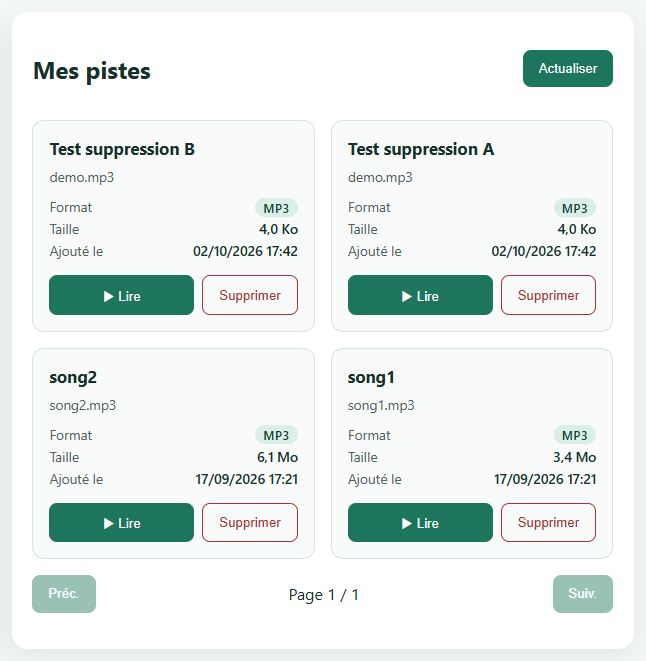
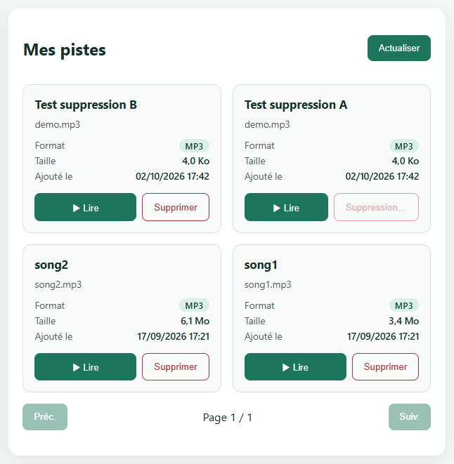
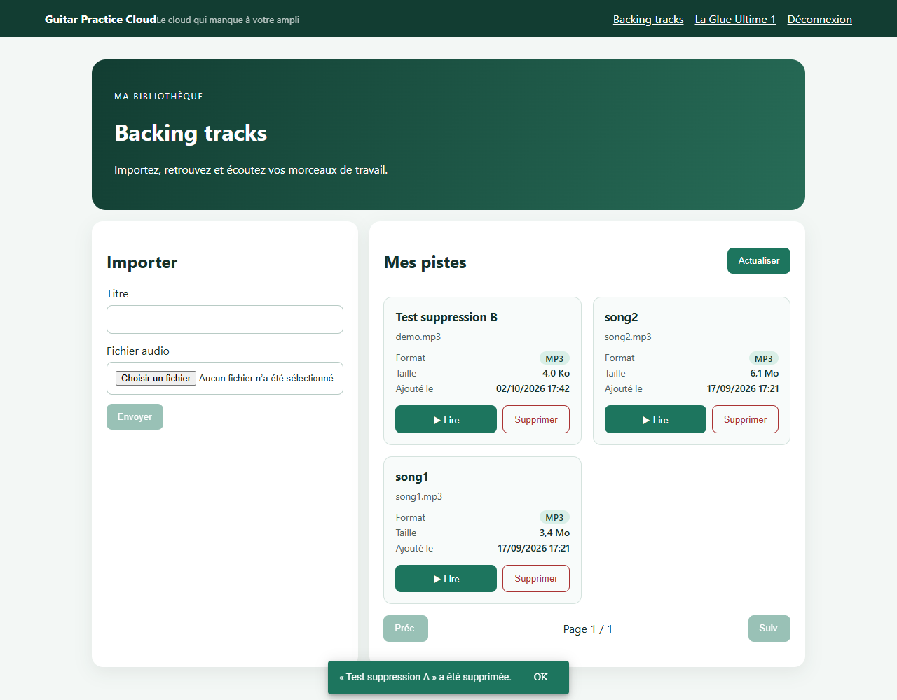
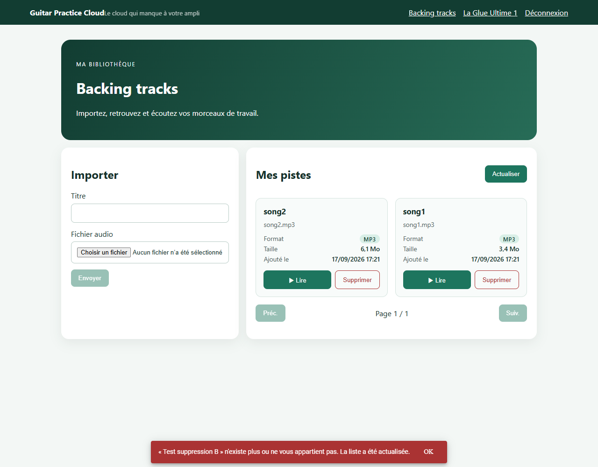

# TP3 — Compte rendu

Binôme : _à compléter_

Sommaire :

1. [Mission 5 — Suppression d'une piste](#mission-5--suppression-dune-piste)
   - [5.1 Composant et service concernés](#51-composant-et-service-concernés)
   - [5.2 Implémentation](#52-implémentation)
   - [5.3 Tests réalisés](#53-tests-réalisés)
   - [5.4 Pourquoi le guard et l'interface ne suffisent pas](#54-pourquoi-le-guard-et-linterface-ne-suffisent-pas)
   - [5.5 Captures et trace réseau](#55-captures-et-trace-réseau)
2. Mission 6 — Progression de l'upload : _à faire_
3. Mission 7 — Tests automatisés : _à faire_

---

## Mission 5 — Suppression d'une piste

### 5.1 Composant et service concernés

Flux : **card de piste → `TracksPageComponent.remove()` → `TrackService.delete()` → `HttpClient` (+ intercepteur JWT) → `DELETE /api/tracks/:id`**

| Rôle | Fichier | Élément |
|---|---|---|
| Interface (bouton dans la card) | `components/tracks-page/tracks-page.html` | `<button class="track-card__delete" (click)="remove(track)">` |
| Logique de l'écran | `components/tracks-page/tracks-page.ts` | `remove()`, `isDeleting()`, `setDeleting()`, `notify()`, `load()` |
| Appel HTTP | `shared/services/track.service.ts` | `delete(id)` → `http.delete<void>('/api/tracks/' + id)` |
| Ajout du JWT, gestion du 401 | `shared/interceptors/auth.interceptor.ts` | Inchangé |
| Contrôle réel côté serveur | `backend/src/app.js` | `app.delete("/api/tracks/:id", auth, …)` → `Track.findOneAndDelete({ _id, ownerId: req.auth.sub })` |

Le composant n'appelle jamais `HttpClient` directement : il passe par `TrackService`.

### 5.2 Implémentation

| Exigence | Implémentation |
|---|---|
| Action « Supprimer » dans chaque card | Bouton à côté de « ▶ Lire », annoncé « Supprimer *titre* » aux lecteurs d'écran |
| Confirmation avant suppression | `confirm('Supprimer définitivement « titre » ?')`. Si l'utilisateur annule, aucune requête n'est envoyée |
| État de suppression contre les doubles clics | Signal `deletingIds` (ensemble des identifiants en cours) : le bouton est désactivé et affiche « Suppression… ». `remove()` ne fait rien si la piste est déjà en cours de suppression |
| Message de succès ou d'erreur (SnackBar) | `MatSnackBar` d'Angular Material : vert pour le succès (4 s, annonce *polite*), rouge pour une erreur (7 s, annonce *assertive*) |
| Mise à jour de la page | `load()` après la suppression. Si la page courante devient vide (dernière piste d'une page > 1), `load()` revient automatiquement à la dernière page existante |
| Piste déjà supprimée ou appartenant à un autre utilisateur | Le backend répond **404** dans les deux cas. Le SnackBar indique « … n'existe plus ou ne vous appartient pas. La liste a été actualisée. », puis la liste est rechargée |
| Session expirée (401) | Déjà gérée par l'intercepteur : déconnexion et retour à `/login` |

Dépendance ajoutée : `@angular/material` et `@angular/cdk` (`~22.1.0`, même version mineure qu'Angular), avec le thème `azure-blue` déclaré dans `angular.json`. Les couleurs du SnackBar sont adaptées à la charte du projet dans `styles.css` (`.snack-success`, `.snack-error`).

### 5.3 Tests réalisés

Test de bout en bout, joué le 02/10/2026 par un script qui pilote Edge (sans fenêtre) avec le compte démo. Les pistes de test ont été créées pour l'occasion, puis supprimées.

| # | Scénario | Résultat attendu | Résultat observé | |
|---|---|---|---|---|
| 1 | Clic sur « Supprimer », puis **Annuler** | Aucune requête, piste toujours affichée | Dialogue « Supprimer définitivement « Test suppression A » ? », aucun `DELETE`, piste présente | ✅ |
| 2a | Clic sur « Supprimer », puis **OK** (réseau ralenti) | Bouton désactivé « Suppression… » | `disabled: true`, texte « Suppression… » | ✅ |
| 2b | **Double clic** pendant la suppression | Une seule requête `DELETE` | Un seul `DELETE /api/tracks/…83 → 204` | ✅ |
| 2c | Fin de la suppression | SnackBar de succès et liste rechargée sans la piste | « « Test suppression A » a été supprimée. » ; liste : Test suppression B, song2, song1 | ✅ |
| 3a | Piste supprimée **dans un autre onglet** mais encore affichée, puis clic sur « Supprimer » | Le backend répond 404 | `DELETE /api/tracks/…84 → 404` | ✅ |
| 3b | Message affiché | SnackBar d'erreur explicite | « « Test suppression B » n'existe plus ou ne vous appartient pas. La liste a été actualisée. » | ✅ |
| 3c | Liste | La piste disparaît | Liste : song2, song1 | ✅ |
| 4 | `DELETE` envoyé **sans JWT** (hors interface) | 401 | `401` | ✅ |

**Résultat : 11 vérifications sur 11 réussies.** La première exécution en avait signalé une en échec : c'était une erreur du script de test, qui lisait la requête de « l'autre onglet » (204) au lieu de celle de l'interface (404). Le script a été corrigé, pas l'application.

**Non testé** : la suppression de la piste d'**un autre utilisateur** avec un second compte réel, qui demanderait de créer un compte dans la base. Le code backend (`findOneAndDelete({ _id, ownerId })`) renvoie le même 404 que pour une piste inexistante, donc l'interface affiche le même message.

### 5.4 Pourquoi le guard et l'interface ne suffisent pas

- **Le guard ne protège que la navigation Angular.** `authGuard` empêche d'afficher `/tracks` sans token. Il ne s'exécute que dans le navigateur, uniquement lors d'un changement de route, et il ne regarde pas les requêtes HTTP. N'importe qui peut envoyer une requête à l'API sans passer par Angular : `curl`, Postman, la console du navigateur, un autre site…
- **L'interface ne contrôle que ce qui est affiché.** Masquer ou désactiver un bouton n'empêche pas d'envoyer `DELETE /api/tracks/<id>` à la main. Le code JavaScript du frontend est public et modifiable par l'utilisateur, donc tout contrôle fait côté client peut être contourné.
- **C'est le backend qui protège réellement la suppression**, à deux niveaux (`app.js`) :
  1. **Authentification** : le middleware `auth` vérifie la signature et la date d'expiration du JWT avec un secret que seul le serveur connaît. Sans JWT valide, la réponse est **401** (test 4).
  2. **Autorisation (propriétaire)** : `Track.findOneAndDelete({ _id: req.params.id, ownerId: req.auth.sub })`. La piste n'est supprimée que si elle appartient à l'utilisateur identifié **par le token**, et non par une donnée envoyée par le client. Sinon, la réponse est **404**. Renvoyer 404 plutôt que 403 évite aussi de révéler qu'une piste existe chez un autre utilisateur.
- **Conclusion** : le guard et l'interface améliorent l'expérience (pas d'écran inutile, confirmation, messages clairs), mais la **sécurité** repose uniquement sur les vérifications du serveur.

### 5.5 Captures et trace réseau

| Card avec « Supprimer » | Suppression en cours |
|---|---|
|  |  |

**Succès** (SnackBar vert, liste rechargée) :



**Piste déjà supprimée ailleurs** (404, SnackBar rouge, liste actualisée) :



Trace réseau ([captures/network-trace-suppression.txt](captures/network-trace-suppression.txt)), token masqué :

```text
DELETE /api/tracks/…83  →  204   Authorization: Bearer ***   (suppression confirmée, une seule malgré le double clic)
GET    /api/tracks?page=1&limit=5  →  200                    (rechargement)
DELETE /api/tracks/…84  →  204   (simulation : suppression depuis un autre onglet)
DELETE /api/tracks/…84  →  404   Authorization: Bearer ***   (clic dans l'interface sur la piste déjà supprimée)
GET    /api/tracks?page=1&limit=5  →  200                    (actualisation)
DELETE /api/tracks/…83  →  401   Authorization: (absent)     (sans JWT)
```

_Capture DevTools à faire par le binôme : onglet Network, requête `DELETE` après confirmation (*Headers* : méthode `DELETE`, statut 204, `Authorization` masqué)._
